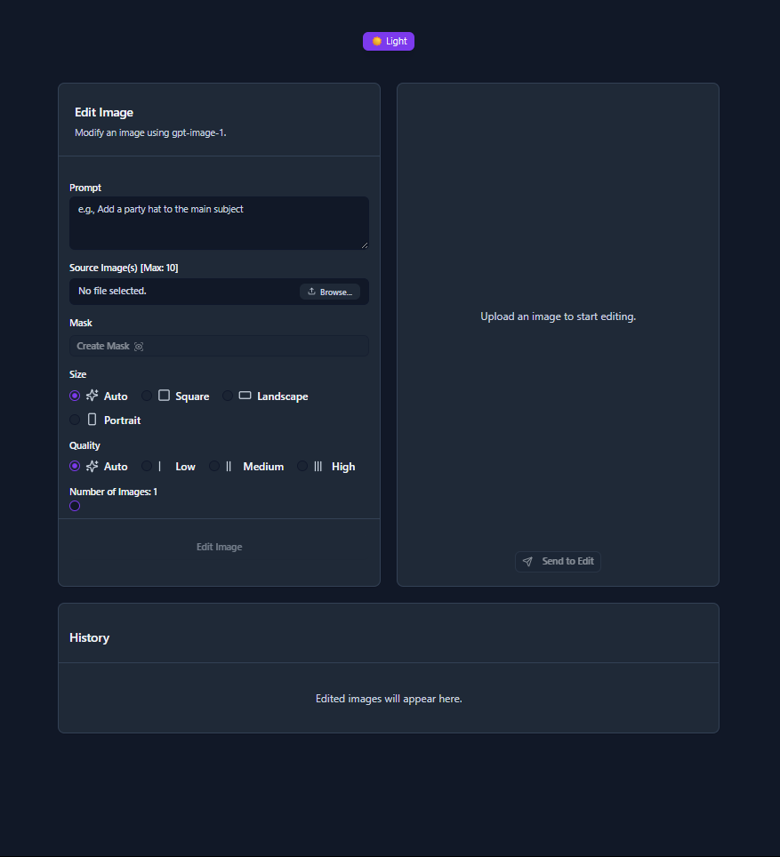
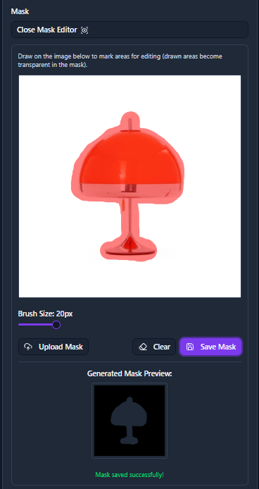
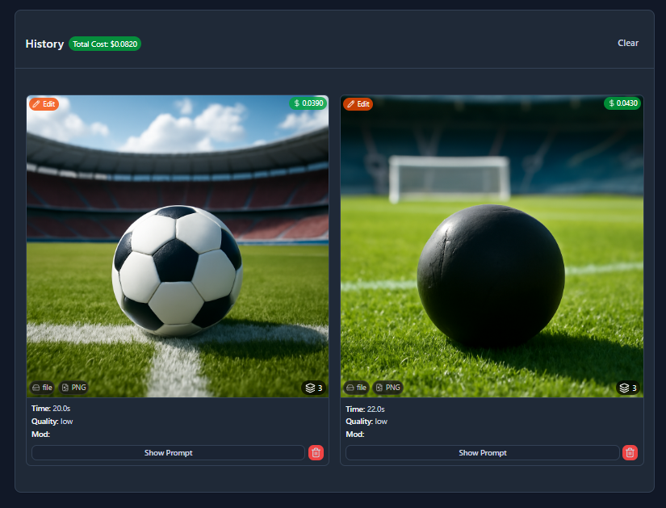
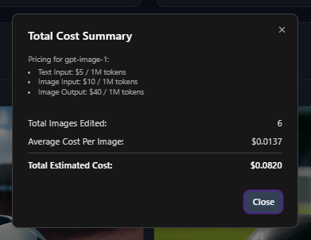
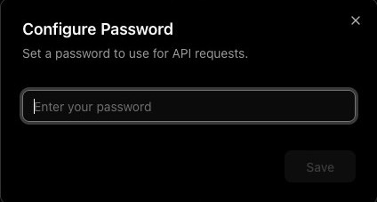

# 🎨 Custom Image Editor - GPT-IMAGE-1 Specialized Tool

*Una herramienta especializada de edición de imágenes basada en el modelo `gpt-image-1` de OpenAI.*

*A specialized image editing tool powered by OpenAI's `gpt-image-1` model.*

<p align="center">
  
</p>

## ✨ Características / Features

### 🇪🇸 Español
*   **🖌️ Editor de Imágenes Especializado:** Modifica imágenes existentes usando prompts de texto y máscaras opcionales.
*   **⚙️ Control Total de Parámetros API:** Accede y ajusta todos los parámetros relevantes soportados por la API de Imágenes de OpenAI directamente desde la interfaz (tamaño, calidad, formato de salida, compresión, fondo, moderación, número de imágenes).
*   **🎭 Herramienta de Máscaras Integrada:** Crea o sube máscaras fácilmente dentro del modo de edición para especificar áreas de modificación. Dibuja directamente sobre la imagen para generar una máscara.

     > ⚠️ Ten en cuenta que la función de máscaras de `gpt-image-1` no garantiza un control del 100% en este momento. <br>1) [Es una limitación conocida y reconocida del modelo.](https://community.openai.com/t/gpt-image-1-problems-with-mask-edits/1240639/37) <br>2) [OpenAI está trabajando para solucionarlo en una actualización futura.](https://community.openai.com/t/gpt-image-1-problems-with-mask-edits/1240639/41)

*   **📜 Historial Detallado y Seguimiento de Costos:**
    *   Ve un historial completo de todas tus ediciones de imágenes.
    *   Observa los parámetros utilizados para cada solicitud.
    *   Obtén desglose detallado del uso de tokens de la API y costos estimados (`$USD`) para cada operación.
    *   Ve el prompt completo utilizado para cada elemento del historial.
    *   Ve el costo total histórico de la API.
    *   Elimina elementos del historial.

*   **🖼️ Vista Flexible de Salida de Imágenes:** Ve lotes de imágenes editadas como una cuadrícula o selecciona imágenes individuales para una vista más cercana.
*   **📋 Pegar para Editar:** Pega imágenes directamente desde tu portapapeles en el área de imagen fuente del modo de edición.
<!-- Autenticación por password hash y Dual storage (lib/db.ts, modo indexeddb + filesystem) 
 Por el momento no me van a servir, voy a trabajar local. -->
*   **💾 Almacenamiento:** Modo local filesystem para desarrollo
<!-- *   **🔒 Autenticación:** Protección opcional con contraseña vía `APP_PASSWORD` -->

### 🇺🇸 English
*   **🖌️ Specialized Image Editor:** Modify existing images using text prompts and optional masks.
*   **⚙️ Full API Parameter Control:** Access and adjust all relevant parameters supported by the OpenAI Images API directly through the UI (size, quality, output format, compression, moderation, number of images).
*   **🎭 Integrated Masking Tool:** Easily create or upload masks directly within the editing mode to specify areas for modification. Draw directly on the image to generate a mask.

     > ⚠️ Please note that `gpt-image-1`'s masking feature does not guarantee 100% control at this time. <br>1) [It's a known & acknowledged model limitation.](https://community.openai.com/t/gpt-image-1-problems-with-mask-edits/1240639/37) <br>2) [OpenAI are looking to address it in a future update.](https://community.openai.com/t/gpt-image-1-problems-with-mask-edits/1240639/41)

*   **📜 Detailed History & Cost Tracking:**
    *   View a comprehensive history of all your image edits.
    *   See the parameters used for each request.
    *   Get detailed API token usage and estimated cost breakdowns (`$USD`) for each operation.
    *   View the full prompt used for each history item.
    *   View total historical API cost.
    *   Delete items from history.

*   **🖼️ Flexible Image Output View:** View edited image batches as a grid or select individual images for a closer look.
*   **📋 Paste to Edit:** Paste images directly from your clipboard into the Edit mode's source image area.
*   **💾 Storage:** Local filesystem mode for development
<!-- *   **🔒 Authentication:** Optional password protection via `APP_PASSWORD` -->

<p align="center">
  
</p>

<p align="center">
  
</p>

<p align="center">
  
</p>

## 🏗️ Estructura del Proyecto / Project Structure

### 🇪🇸 Español
```
├── src/
│   ├── app/
│   │   ├── api/
│   │   │   ├── images/route.ts          # API principal para edición de imágenes
│   │   │   ├── image-delete/route.ts    # API para eliminar imágenes
│   │   │   └── image/[filename]/route.ts # API para servir imágenes
│   │   ├── page.tsx                     # Página principal de la aplicación
│   │   └── layout.tsx                   # Layout base
│   ├── components/
│   │   ├── editing-form.tsx             # Formulario de edición de imágenes
│   │   ├── history-panel.tsx            # Panel de historial
│   │   ├── image-output.tsx             # Componente de salida de imágenes
│   │   ├── password-dialog.tsx          # Diálogo de contraseña
│   │   └── ui/                          # Componentes UI base
│   └── lib/
│       ├── cost-utils.ts                # Utilidades de cálculo de costos
│       ├── db.ts                        # Base de datos IndexedDB
│       └── utils.ts                     # Utilidades generales
├── .env.local                           # Variables de entorno (crear manualmente)
└── README.md                            # Este archivo
```

### 🇺🇸 English
```
├── src/
│   ├── app/
│   │   ├── api/
│   │   │   ├── images/route.ts          # Main API for image editing
│   │   │   ├── image-delete/route.ts    # API for image deletion
│   │   │   └── image/[filename]/route.ts # API for serving images
│   │   ├── page.tsx                     # Main application page
│   │   └── layout.tsx                   # Base layout
│   ├── components/
│   │   ├── editing-form.tsx             # Image editing form
│   │   ├── history-panel.tsx            # History panel
│   │   ├── image-output.tsx             # Image output component
│   │   ├── password-dialog.tsx          # Password dialog
│   │   └── ui/                          # Base UI components
│   └── lib/
│       ├── cost-utils.ts                # Cost calculation utilities
│       ├── db.ts                        # IndexedDB database
│       └── utils.ts                     # General utilities
├── .env.local                           # Environment variables (create manually)
└── README.md                            # This file
```

## ▲ Deploy to Vercel

🚨 *CAUTION: If you deploy from `main` or `master` branch, your Vercel deployment will be **publicly available** to anyone who has the URL. Deploying from other branches will require users to be logged into Vercel (on your team) to access the preview build.* 🚨

You can deploy your own instance of this image editor to Vercel with one click:

[](https://vercel.com/new/clone?repository-url=https://github.com/ElChafa/gpt-image-1-mask-edit&env=OPENAI_API_KEY,NEXT_PUBLIC_IMAGE_STORAGE_MODE,APP_PASSWORD&envDescription=OpenAI%20API%20Key%20is%20required.%20Set%20storage%20mode%20to%20indexeddb%20for%20Vercel%20deployments.&project-name=custom-image-editor&repository-name=custom-image-editor)

You will be prompted to enter your `OPENAI_API_KEY` during the deployment setup.

<!-- Note: Password authentication and dual storage modes commented out for local development -->
<!-- Note: If `NEXT_PUBLIC_IMAGE_STORAGE_MODE` is not set, the application will automatically detect if it's running on Vercel (using the `VERCEL` or `NEXT_PUBLIC_VERCEL_ENV` environment variables) and default to `indexeddb` mode in that case. Otherwise (e.g., running locally), it defaults to `fs` mode. You can always explicitly set the variable to `fs` or `indexeddb` to override this automatic behavior. -->

## 🚀 Comenzando / Getting Started

### Prerrequisitos / Prerequisites

*   [Node.js](https://nodejs.org/) (Versión 20 o posterior requerida / Version 20 or later required)
*   [npm](https://www.npmjs.com/), [yarn](https://yarnpkg.com/), [pnpm](https://pnpm.io/), o [bun](https://bun.sh/)

### 1. Configurar Clave API / Set Up API Key 🟢

**🇪🇸 Español:**
Necesitas una clave API de OpenAI para usar esta aplicación.

⚠️ [Tu Organización de OpenAI necesita estar verificada para usar `gpt-image-1`](https://help.openai.com/en/articles/10910291-api-organization-verification)

1.  Si no tienes un archivo `.env.local`, créalo.
2.  Agrega tu clave API de OpenAI al archivo `.env.local`:

**🇺🇸 English:**
You need an OpenAI API key to use this application.

⚠️ [Your OpenAI Organization needs to be verified to use `gpt-image-1`](https://help.openai.com/en/articles/10910291-api-organization-verification)

1.  If you don't have a `.env.local` file, create one.
2.  Add your OpenAI API key to the `.env.local` file:

```dotenv
OPENAI_API_KEY=your_openai_api_key_here
```

**Importante / Important:** Mantén tu clave API en secreto. El archivo `.env.local` está incluido en `.gitignore` por defecto para prevenir commits accidentales. / Keep your API key secret. The `.env.local` file is included in `.gitignore` by default to prevent accidental commits.

---

<!-- #### 🟡 (Opcional / Optional) Modo IndexedDB

**🇪🇸:** Para entornos donde el sistema de archivos es de solo lectura o efímero (como las funciones serverless de Vercel), puedes configurar la aplicación para almacenar imágenes editadas directamente en el IndexedDB del navegador.

**🇺🇸:** For environments where the filesystem is read-only or ephemeral (like Vercel serverless functions), you can configure the application to store edited images directly in the browser's IndexedDB.

```dotenv
NEXT_PUBLIC_IMAGE_STORAGE_MODE=indexeddb
``` -->

#### 🟡 (Opcional / Optional) Endpoint API Personalizado / Custom API Endpoint

**🇪🇸:** Si necesitas usar un endpoint de API compatible con OpenAI (ej. un servidor de modelo local o un proveedor diferente), puedes especificar su URL base:

**🇺🇸:** If you need to use an OpenAI-compatible API endpoint (e.g., a local model server or a different provider), you can specify its base URL:

```dotenv
OPENAI_API_KEY=your_openai_api_key_here
OPENAI_API_BASE_URL=your_compatible_api_endpoint_here
```

<!-- #### 🟡 (Opcional / Optional) Validación de Contraseña / Password Validation

```dotenv
APP_PASSWORD=your_password_here
```

**🇪🇸:** Cuando `APP_PASSWORD` está configurado, el frontend te pedirá una contraseña para autenticar las solicitudes.

**🇺🇸:** When `APP_PASSWORD` is set, the frontend will prompt you for a password to authenticate requests.

<p align="center">
  
</p> -->

---

### 2. Instalar Dependencias / Install Dependencies 🟢

**🇪🇸:** Navega al directorio del proyecto en tu terminal e instala los paquetes necesarios:

**🇺🇸:** Navigate to the project directory in your terminal and install the necessary packages:

```bash
npm install
# o / or
# yarn install
# o / or
# pnpm install
# o / or
# bun install
```

### 3. Ejecutar el Servidor de Desarrollo / Run the Development Server 🟢

**🇪🇸:** Inicia el servidor de desarrollo de Next.js:

**🇺🇸:** Start the Next.js development server:

```bash
npm run dev
# o / or
# yarn dev
# o / or
# pnpm dev
# o / or
# bun dev
```

### 4. Abrir el Editor / Open the Editor 🟢

**🇪🇸:** Abre [http://localhost:3000](http://localhost:3000) en tu navegador web. ¡Ahora deberías poder usar el Editor de Imágenes Personalizado!

**🇺🇸:** Open [http://localhost:3000](http://localhost:3000) in your web browser. You should now be able to use the Custom Image Editor!

## 🎯 Funcionalidad Principal / Main Functionality

**🇪🇸 Español:**
Esta aplicación está especializada en la **edición de imágenes** usando el modelo `gpt-image-1` de OpenAI. Las características principales incluyen:

- ✏️ **Edición con prompts de texto:** Describe los cambios que quieres hacer
- 🎭 **Sistema de máscaras:** Especifica exactamente qué áreas editar
- 📊 **Seguimiento de costos:** Monitorea el uso de la API en tiempo real
- 📜 **Historial completo:** Guarda todas tus ediciones con metadatos
- 🔧 **Control avanzado:** Ajusta todos los parámetros de la API

**🇺🇸 English:**
This application specializes in **image editing** using OpenAI's `gpt-image-1` model. Main features include:

- ✏️ **Text prompt editing:** Describe the changes you want to make
- 🎭 **Masking system:** Specify exactly which areas to edit
- 📊 **Cost tracking:** Monitor API usage in real-time
- 📜 **Complete history:** Save all your edits with metadata
- 🔧 **Advanced control:** Adjust all API parameters

## 🤝 Contribuciones / Contributing

**🇪🇸:** ¡Las contribuciones son bienvenidas! Los issues y solicitudes de características, no tanto, pero lo pensaré.

**🇺🇸:** Contributions are welcome! Issues and feature requests, not as much welcome but I'll think about it.

## 📄 Licencia / License

MIT
